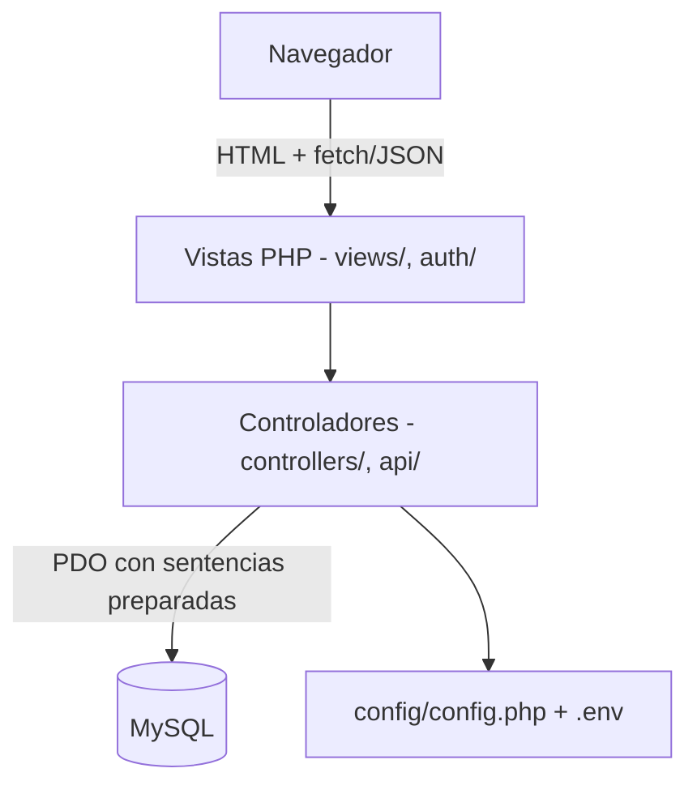

<div align="center">
  
  <h1 align="center">Alondra ✨</h1>
  <p align="center">
    <strong>Sistema de calendario estudiantil: eventos, tareas y recordatorios académicos.</strong>
  </p>

  <p align="center">
    
    
    
    
  </p>
</div>

---

## Qué es Alondra

Alondra es una aplicación PHP + MySQL para que un estudiante organice su
agenda académica: crear cuentas, iniciar sesión, registrar eventos/
tareas/recordatorios con fecha y hora, agruparlos por categorías con
color propio, y verlos tanto en una lista como en un calendario mensual
interactivo.

| Característica | Descripción |
| :--- | :--- |
| 🔐 **Autenticación** | Registro e inicio de sesión con contraseñas hasheadas (`password_hash`/`password_verify`) y protección CSRF. |
| 📅 **Calendario mensual** | Vista de calendario navegable por mes, con los eventos de cada día coloreados según su categoría. |
| 🗂️ **Categorías** | Categorías personalizadas por usuario (nombre, color, descripción); se crean unas por defecto al registrarse. |
| ✅ **Eventos y tareas** | Alta, edición y borrado de eventos/tareas/recordatorios vía una API JSON propia (`api/events.php`, `api/categories.php`). |
| 📊 **Panel principal** | Resumen con estadísticas rápidas (eventos de hoy, totales) y accesos directos. |

> **Nota:** dentro de `alondra-pro/` hay un rediseño independiente y aún
> incompleto del mismo producto sobre Next.js + Prisma. No sustituye a
> la aplicación PHP descrita en este README - conviven en el mismo
> repositorio mientras esa reescritura avanza. Ver
> [`alondra-pro/README.md`](./alondra-pro/README.md) para arrancarlo por
> separado.

---

## Arquitectura



- **PHP puro**, sin framework: `auth/` (login/registro), `controllers/`
  (procesa los formularios), `api/` (endpoints JSON para eventos y
  categorías), `views/` (páginas del panel) y `config/` (conexión a la
  base de datos y configuración).
- **MySQL** vía PDO con sentencias preparadas en todas las consultas.
- **Sin dependencias de frontend**: JavaScript plano en `public/js/` y
  en cada vista.

---

## Guía rápida de instalación (XAMPP/Laragon)

### 1. Requisitos previos
- PHP 8.0+ con la extensión `pdo_mysql` habilitada.
- MySQL/MariaDB corriendo (con Laragon, si no arranca solo, iniciar
  `mysqld.exe` manualmente o abrir la app de Laragon y pulsar "Start
  All").
- (Opcional, para tests) [Composer](https://getcomposer.org/).

### 2. Clonar el proyecto
Clona (o copia) este repositorio dentro de la carpeta pública de tu
servidor, por ejemplo `C:\laragon\www\Alondra` o `htdocs/Alondra` en
XAMPP, de forma que quede accesible en `http://localhost/Alondra`.

### 3. Configurar la conexión a la base de datos
Copia `.env.example` a `.env` y ajusta los valores si tu instalación de
MySQL no usa los valores por defecto de XAMPP/Laragon (`root` sin
contraseña):

```bash
cp .env.example .env
```

Si no creas un `.env`, `config/config.php` usa esos mismos valores por
defecto, así que en la mayoría de instalaciones locales funciona sin
tocar nada.

### 4. Crear la base de datos y aplicar las migraciones
Crea una base de datos llamada `alondra` (o el nombre que hayas puesto
en `DB_NAME`) y ejecuta las migraciones en orden, por ejemplo desde la
terminal:

```bash
mysql -u root -e "CREATE DATABASE alondra CHARACTER SET utf8mb4;"
mysql -u root alondra < database/migrations/001_create_usuarios.sql
mysql -u root alondra < database/migrations/002_create_categorias.sql
mysql -u root alondra < database/migrations/003_create_eventos.sql
```

(También puedes importar cada archivo desde phpMyAdmin, en el mismo
orden.)

### 5. Cargar datos de ejemplo (opcional)
```bash
mysql -u root alondra < database/seeds/001_create_usuarios.sql
mysql -u root alondra < database/seeds/002_categorias.sql
mysql -u root alondra < database/seeds/003_eventos.sql
```

Esto crea, entre otros, un usuario administrador de prueba:

- **Correo:** `admin@alondra.edu`
- **Contraseña:** `123456`

(cámbiala o bórrala antes de exponer la aplicación fuera de tu propia
máquina).

### 6. Abrir la aplicación
Con Apache y MySQL corriendo, abre `http://localhost/Alondra` en el
navegador - te redirige a la pantalla de inicio de sesión.

---

## Pruebas automatizadas

El núcleo de validación (fortaleza de contraseña, fechas/horas de
eventos) tiene una suite de PHPUnit independiente de la base de datos:

```bash
composer install
composer test
# o directamente:
vendor/bin/phpunit
```

---

## Estructura del proyecto

```
api/            Endpoints JSON (eventos, categorías)
auth/           Login, registro y logout
app/            Clases PHP reutilizables y con tests (validación)
config/         Conexión a MySQL, configuración y CSRF
controllers/    Procesan los POST de login/registro
database/       Migraciones y seeds SQL
public/         CSS, JS e imágenes servidas al navegador
tests/          Suite de PHPUnit
views/          Páginas del panel (dashboard, calendario, eventos)
alondra-pro/    Rediseño independiente en Next.js (ver nota arriba)
```

---

## Licencia

MIT - ver [`LICENSE`](./LICENSE).
