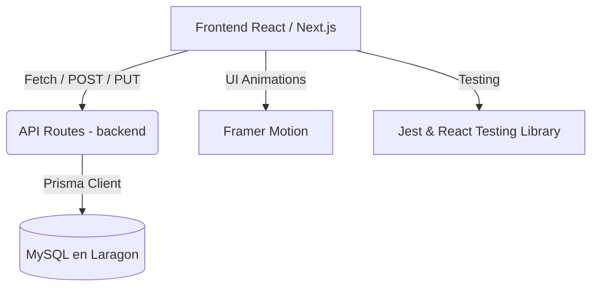

<div align="center">
  
  <h1 align="center">Alondra Pro ✨</h1>
  <p align="center">
    <strong>El ecosistema de estudio inteligente definitivo, impulsado por IA.</strong>
    <br />
    <i>De un prototipo monolítico a una Arquitectura Empresarial Full-Stack</i>
  </p>

  <p align="center">
    
    
    
    
    
  </p>
</div>

---

> [!WARNING]
> **Aviso Arquitectónico:** Este repositorio representa la evolución final bajo la metodología **SDD (Spec-Driven Development)**. El antiguo código en PHP (legacy) ha sido reemplazado por completo por una **SPA (Single Page Application)** alojada dentro del subdirectorio `/alondra-pro`.

## 🚀 La Evolución a SaaS

Alondra Pro no es solo un calendario; es tu co-piloto académico. Reescrito desde cero, cuenta con una API RESTful propia conectada a una base de datos relacional robusta.

### 🌟 Funcionalidades Clave

| Característica | Descripción | Estado |
| :--- | :--- | :---: |
| 🖱️ **Drag & Drop Real-time** | Mueve eventos libremente. Persiste en MySQL vía API `PUT` automática. | ✅ |
| 🧠 **IA Planificador (Chat)** | Interfaz animada dedicada para recibir sugerencias automáticas de la IA. | ✅ |
| 📊 **Dashboard de Analytics** | Panel interactivo de rendimiento (Horas de estudio, productividad). | ✅ |
| 🌓 **Glassmorphism & Temas** | Efectos translúcidos con *Theme Toggle* (Claro/Oscuro). | ✅ |
| 🔔 **Micro-Interacciones** | Animaciones de resorte (*Spring*) y *Toasts* flotantes vía Framer Motion. | ✅ |

---

## 🏗 Arquitectura del Sistema (SDD)

El flujo de datos moderno opera de la siguiente manera:



---

## 💻 Guía Rápida de Despliegue (Local)

Alondra Pro ahora utiliza **MySQL** como motor principal. Sigue estos pasos para arrancar el entorno en tu máquina local.

### 1. Requisitos Previos
Asegúrate de tener [Laragon](https://laragon.org/) ejecutándose con su servidor MySQL activado en el puerto `3306`.

### 2. Instalación y Base de Datos
```bash
# Navega al nuevo núcleo del proyecto
cd alondra-pro

# Instala las dependencias del ecosistema
npm install

# Crea la base de datos (alondra_pro) e inyecta el esquema de tablas
npx prisma db push
```

### 3. Ejecución del Servidor
```bash
# Arranca el servidor de Next.js
npm run dev
```
> 👉 Abre **[http://localhost:3000/dashboard](http://localhost:3000/dashboard)** para ver la magia de la UI animada y el guardado en base de datos en acción.

---

## 🧪 Pruebas Unitarias (QA)

Para garantizar un código mantenible, Alondra Pro incluye un robusto entorno de testing. Ejecuta los tests de renderizado y componentes con:
```bash
npm run test
```

---

## 📚 Documentación Adjunta

Hemos generado literatura oficial para acompañar el producto:
- 📖 [Manual de Usuario Oficial](./User_Manual.md)
- 📝 [Especificación Arquitectónica (SDD)](./implementation_plan.md)
- 🛤️ [Bitácora de Refactorización](./walkthrough.md)

---
<div align="center">
  <i>Ingeniería de software al servicio de la excelencia académica.</i>
</div>
