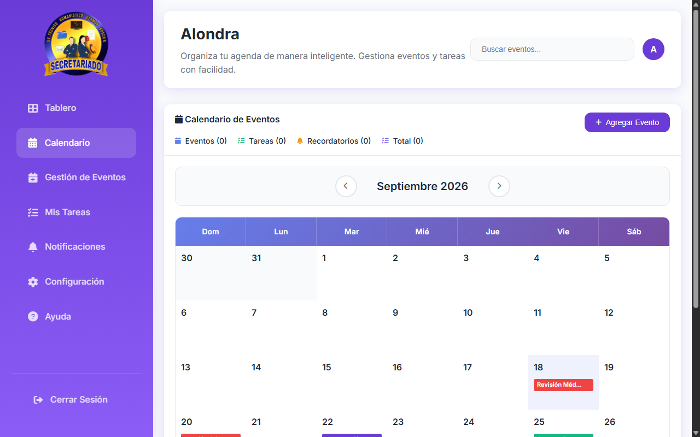
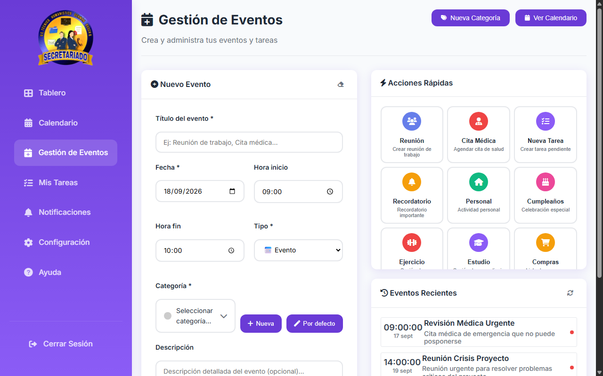
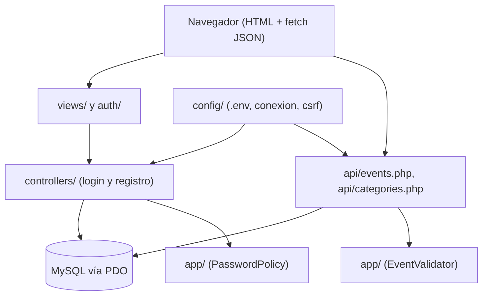

<div align="center">
  
  <h1>Alondra</h1>
  <p><b>Calendario estudiantil en PHP + MySQL: eventos, tareas y recordatorios con categorías de color.</b></p>
  
  
  
  
  
  <br />
  
  <p>
    <a href="#-inicio-rápido">Inicio rápido</a> ·
    <a href="#-características">Características</a> ·
    <a href="#️-arquitectura">Arquitectura</a> ·
    <a href="#-pruebas">Pruebas</a> ·
    <a href="#-lo-que-todavía-no-existe">Limitaciones</a>
  </p>
</div>

Alondra es una aplicación web en **PHP sin framework** y MySQL con la que un estudiante registra
eventos, tareas y recordatorios, los agrupa en categorías con color y los ve en un calendario mensual.
**No es** un producto terminado: el tablero principal mezcla datos reales con bloques de ejemplo fijos
y varias opciones del menú aún no existen (ver [limitaciones](#-lo-que-todavía-no-existe)).

## 🎬 Vista rápida

Capturas reales tomadas con el seed de ejemplo del repositorio (datos ficticios):

| Calendario mensual | Gestión de eventos |
| :---: | :---: |
|  |  |

## ✨ Características

| Característica | Detalle |
| :--- | :--- |
| 🔐 Autenticación | Registro e inicio de sesión (`auth/`, `controllers/`) con `password_hash` / `password_verify` y token CSRF por sesión. |
| 🛡️ Política de contraseñas | Mínimo 8 caracteres con letras y números (`App\Validation\PasswordPolicy`). |
| 📅 Calendario mensual | Vista navegable por mes que carga los eventos desde `api/events.php` y los colorea por categoría. |
| 🗂️ Categorías | Categorías por usuario (nombre, color, descripción) vía `api/categories.php`; se crean unas por defecto al registrarse. |
| ✅ Eventos, tareas y recordatorios | Alta, edición y borrado (POST/PUT/DELETE, con verificación CSRF) filtrados por el usuario en sesión. |
| 🧾 Validación de eventos | Fechas y horas validadas en `App\Calendar\EventValidator`. |

## 🏗️ Arquitectura



- Consultas con sentencias preparadas PDO y filtro por `usuario_id`.
- Sin dependencias de frontend propias: JavaScript plano; los iconos y fuentes se cargan desde CDN.
- `alondra-pro/` es un **rediseño independiente** en Next.js + Prisma, incompleto; no forma parte de la app PHP (ver su [README](./alondra-pro/README.md)).

## 🚀 Inicio rápido

| Requisito | Versión |
| :--- | :--- |
| PHP con `pdo_mysql` | 8.0 o superior (CI prueba 8.1 y 8.2) |
| MySQL / MariaDB | en ejecución local |
| Composer | solo para las pruebas |

1. Clona el repositorio dentro de la carpeta pública de tu servidor **con el nombre `Alondra`**
   (p. ej. `C:\laragon\www\Alondra`). Importante: los enlaces del menú y los logos usan la ruta fija
   `/Alondra/...`, así que la app debe servirse en `http://localhost/Alondra`.
2. Configura la conexión (opcional; sin `.env` se usan `root` sin contraseña):
   ```bash
   cp .env.example .env
   ```
3. Crea la base y aplica las migraciones en orden:
   ```bash
   mysql -u root -e "CREATE DATABASE alondra CHARACTER SET utf8mb4;"
   mysql -u root alondra < database/migrations/001_create_usuarios.sql
   mysql -u root alondra < database/migrations/002_create_categorias.sql
   mysql -u root alondra < database/migrations/003_create_eventos.sql
   ```
4. (Opcional) Carga datos de ejemplo:
   ```bash
   mysql -u root --default-character-set=utf8mb4 alondra < database/seeds/001_create_usuarios.sql
   mysql -u root --default-character-set=utf8mb4 alondra < database/seeds/002_categorias.sql
   mysql -u root --default-character-set=utf8mb4 alondra < database/seeds/003_eventos.sql
   ```
   Crea usuarios de prueba (por ejemplo `admin@alondra.edu`, contraseña `123456`). Bórralos o cámbialos
   antes de exponer la app fuera de tu máquina. Los eventos del seed son de octubre de 2025.
5. Abre `http://localhost/Alondra`: redirige al inicio de sesión.

<details>
<summary>Variables de entorno (<code>.env</code>)</summary>

| Variable | Por defecto | Uso |
| :--- | :--- | :--- |
| `DB_HOST` | `127.0.0.1` | Servidor MySQL |
| `DB_NAME` | `alondra` | Nombre de la base |
| `DB_USER` / `DB_PASS` | `root` / vacío | Credenciales |
| `BASE_URL` | `http://localhost/Alondra` | URL base |
| `APP_DEBUG` | `true` | Muestra errores detallados; en un servidor público debe ser `false` |

</details>

<details>
<summary>Estructura de carpetas</summary>

```
api/            Endpoints JSON (eventos, categorías, categorías por defecto)
auth/           Login, registro y logout
app/            Clases reutilizables con tests (EventValidator, PasswordPolicy)
config/         Conexión, configuración, CSRF y manejo de errores
controllers/    Procesan los POST de login y registro
database/       Migraciones y seeds SQL
public/         CSS, JS e imágenes
tests/          Suite de PHPUnit
views/          Dashboard, calendario y formulario de eventos
alondra-pro/    Rediseño independiente en Next.js (incompleto)
```

</details>

## 🧪 Pruebas

```bash
composer install
vendor/bin/phpunit
```

**33 tests** (verificados) sobre `EventValidator` y `PasswordPolicy`; no necesitan base de datos.
No hay pruebas de los endpoints, las vistas ni el flujo de login. El CI (`.github/workflows/ci.yml`)
ejecuta `php -l` en todos los archivos, PHPUnit en PHP 8.1 y 8.2, y las pruebas de `alondra-pro`
(estas últimas con `continue-on-error`, porque hay un test conocido que falla).

## 🔒 Seguridad

- Contraseñas con `password_hash`; sentencias preparadas PDO.
- Token CSRF en formularios y en las peticiones POST/PUT/DELETE de la API.
- Las consultas de la API filtran por el usuario autenticado.
- Aviso: los seeds incluyen usuarios con contraseña conocida y `APP_DEBUG` está en `true` en `.env.example`.

## 🚧 Lo que todavía no existe

- **El tablero mezcla datos reales y de ejemplo**: solo "Eventos hoy" y "Total eventos" salen de la base;
  "Próximas tareas", "Actividad reciente" y los porcentajes de tendencia son texto fijo en la vista.
- "Completados" y "Pendientes" dependen de `api/eventos.php`, que **no existe** (la API real es
  `api/events.php`); "Pendientes" cae a un valor fijo de 3.
- "Crear evento rápido" del tablero solo muestra un `alert`; "estadísticas" y "exportar" están marcados como "en desarrollo".
- Las opciones del menú Mis Tareas, Notificaciones, Configuración y Ayuda enlazan a `#`. No hay recordatorios ni notificaciones efectivas.
- Los contadores del encabezado del calendario mostraron `(0)` en las capturas aunque el mes tenía eventos.
- La ruta `/Alondra/` está fija en vistas y menú; no es configurable.
- No hay pruebas de integración ni de interfaz.
- `alondra-pro/` (Next.js) es un prototipo independiente, no una migración terminada.

## 📄 Licencia

MIT. Ver [`LICENSE`](./LICENSE).

<div align="center">
  <sub>Hecho por Luiss2080 · Proyecto académico en evolución</sub>
</div>
